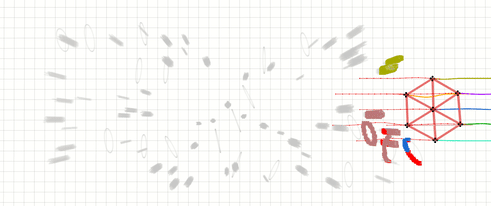

# Swarm-Formation

**Swarm-Formation** is a distributed swarm trajectory optimization framwork for formation flight in dense environments.
- A differentiable graph-theory-based cost function that effectively describes the interaction topology of robots and quantifies the similarity distance between three-dimensional formations.
- A spatial-temporal optimization framework with a joint cost function that takes formation similarity, obstacle avoidance, and dynamic feasibility into account, which makes the swarm robots has the ability to balance moving in formation while avoiding obstacles.


# Updates
- **April 12, 2022** - A distributed swarm formation optizamition framework is released. An example of normal hexagon formation navigation in random forest map is given.
- **Plan** - A more general pipeline for swarm formation navigation in dense environment is on the way.

# About
If our source code is used in your academic projects, please cite our paper. Thank you!

**Author**: [Lun Quan*](http://zju-fast.com/lun-quan/), [Longji Yin*](http://zju-fast.com/longji-yin/), [Chao Xu](http://zju-fast.com/research-group/chao-xu/), and [Fei Gao](http://zju-fast.com/research-group/fei-gao/), from [Fast-Lab](http://zju-fast.com/),Zhejiang University.

**Paper**: [Distributed Swarm Trajectory Optimization for Formation Flight in Dense Environments](https://arxiv.org/abs/2109.07682), Lun Quan*, Longji Yin*, Chao Xu, and Fei Gao. Accpted in [ICRA2022](https://www.icra2022.org/).
```
@article{quan2021distributed,
      title={Distributed Swarm Trajectory Optimization for Formation Flight in Dense Environments}, 
      author={Lun Quan and Longji Yin and Chao Xu and Fei Gao},
      journal={arXiv preprint arXiv:2109.07682},
      year={2021}
}
```
Video Links: [Bilibili](https://www.bilibili.com/video/BV1qv41137Si?spm_id_from=333.999.0.0) (only for Mainland China) or [Youtube](https://www.youtube.com/watch?v=lFumt0rJci4).

# Quick Start within 3 Minutes
Compiling tests passed on ubuntu 18.04 and 20.04 with ros installed. You can just execute the following commands one by one.
```
sudo apt-get install libarmadillo-dev
git clone https://github.com/ZJU-FAST-Lab/Swarm-Formation.git
cd Swarm-Formation
catkin_make -j1
source devel/setup.bash
roslaunch ego_planner rviz.launch
```
Then open a new command window in the same workspace and execute the following commands one by one.
```
source devel/setup.bash
roslaunch ego_planner normal_hexagon.launch
```
Finally, you can see a normal hexagon formation navigating in random forest map.

<p align = "center">

</p>

If you find this work useful or interesting, please kindly give us a star :star:, thanks!:grinning:

# Acknowledgements
**There are several important works which support this project:**
- [GCOPTER](https://github.com/ZJU-FAST-Lab/GCOPTER): An efficient and versatile multicopter trajectory optimizer built upon a novel sparse trajectory representation named [MINCO](https://arxiv.org/pdf/2103.00190v2.pdf).
- [LBFGS-Lite](https://github.com/ZJU-FAST-Lab/LBFGS-Lite): An Easy-to-Use Header-Only L-BFGS Solver.
- [EGO-Swarm](https://github.com/ZJU-FAST-Lab/ego-planner-swarm): A Fully Autonomous and Decentralized Quadrotor Swarm System in Cluttered Environments.

# Licence
The source code is released under [GPLv3](https://www.gnu.org/licenses/) license.

# Maintenance
We are still working on extending the proposed system and improving code reliability.

For any technical issues, please contact Lun Quan (lunquan@zju.edu.cn) or Fei Gao (fgaoaa@zju.edu.cn).

For commercial inquiries, please contact Fei Gao (fgaoaa@zju.edu.cn).