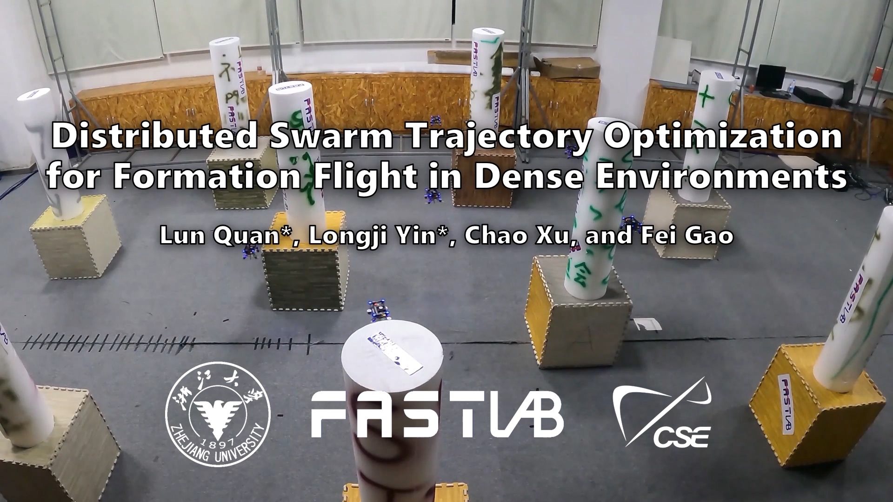
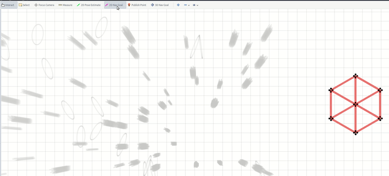
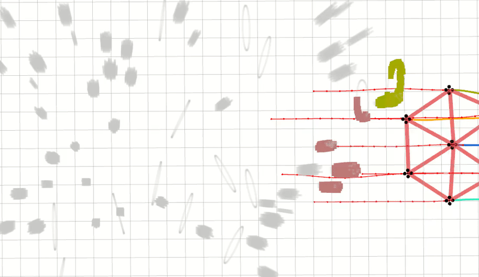

# Swarm-Formation

**Swarm-Formation** is a distributed swarm trajectory optimization framework for formation flight in dense environments.
- A differentiable graph-theory-based cost function that effectively describes the interaction topology of robots and quantifies the similarity distance between three-dimensional formations.
- A spatial-temporal optimization framework with a joint cost function that takes formation similarity, obstacle avoidance, and dynamic feasibility into account, which makes the swarm robots possess the ability to move in formation while avoiding obstacles.

## News
- **October 9, 2022** - An improved version which achieves fully autonomous large-scale formation flight in dense environments with a complete formation navigation system has been submitted to IEEE Transactions on Robotics [Preprint](https://arxiv.org/abs/2210.04048), [Bilibili](https://www.bilibili.com/video/BV1wB4y177io/?spm_id_from=333.999.0.0).
- **April 20, 2022** - A robust version [v1.1](https://github.com/ZJU-FAST-Lab/Swarm-Formation/releases/tag/v1.1) has been open-sourced for [ICRA2022](https://arxiv.org/abs/2109.07682).

## Table of Contents
* [About](#1-About)
* [Quick Start within 3 Minutes](#2-Quick-Start-within-3-Minutes)
* [Tips](#3-Tips)
* [Important updates](#4-Important-updates)
* [Acknowledgements](#5-Acknowledgements)
* [Licence](#6-Licence)
* [Maintenance](#7-Maintenance)

## 1. About
**Author**: [Lun Quan*](http://zju-fast.com/lun-quan/), [Longji Yin*](http://zju-fast.com/longji-yin/), [Chao Xu](http://zju-fast.com/research-group/chao-xu/), and [Fei Gao](http://zju-fast.com/research-group/fei-gao/), from [Fast-Lab](http://zju-fast.com/),Zhejiang University.

**Paper**: [Distributed Swarm Trajectory Optimization for Formation Flight in Dense Environments](https://arxiv.org/abs/2109.07682), Lun Quan*, Longji Yin*, Chao Xu, and Fei Gao. Accepted in [ICRA2022](https://www.icra2022.org/).

```
@article{quan2021distributed,
      title={Distributed Swarm Trajectory Optimization for Formation Flight in Dense Environments}, 
      author={Lun Quan and Longji Yin and Chao Xu and Fei Gao},
      journal={arXiv preprint arXiv:2109.07682},
      year={2021}
}
```
If our source code is used in your academic projects, please cite our paper. Thank you!

<a href="https://www.youtube.com/watch?v=lFumt0rJci4" target="blank">
  <p align="center">
    
  </p>
</a>

Video Links: [Bilibili](https://www.bilibili.com/video/BV1qv41137Si?spm_id_from=333.999.0.0) (only for Mainland China) or [Youtube](https://www.youtube.com/watch?v=lFumt0rJci4).

## 2. Quick Start within 3 Minutes
Compiling tests passed on ubuntu 18.04 and 20.04 with ros installed. You can just execute the following commands one by one.
```
sudo apt-get install libarmadillo-dev
git clone https://github.com/ZJU-FAST-Lab/Swarm-Formation.git
cd Swarm-Formation
catkin_make -j1
source devel/setup.bash
roslaunch ego_planner rviz.launch
```
Then open a new command window in the same workspace and execute the following commands one by one.
```
source devel/setup.bash
roslaunch ego_planner normal_hexagon.launch
```
Then use **"2D Nav Goal"** in rviz to publish the goal for swarm formation navigation. You need to specify the value of **flight_type** in run_in_sim.launch:
<p align = "center">

</p>

**Now only two forms are supported to specify the target point.**
- flight_type = 2: use global waypoints
- flight_type = 3: use "2D Nav Goal" to select goal  

Finally, you can see a normal hexagon formation navigating in random forest map.

<p align = "center">

</p>

If you find this work useful or interesting, please kindly give us a star :star:, thanks!:grinning:
### 2.1 Quick Start with Docker
If your operating system doesn't support ROS noetic, docker is a great alternative.

First of all, you have to build the project and create an image like so:
```bash
## Assuimg you are in the correct project directory
make docker_build
```
After the image is created, copy and paste the following command to the terminal to run the image:

```bash
xhost +
make docker_run
```
Then execute the following command;

```
roslaunch ego_planner normal_hexagon.launch
```

## 3. Tips
1. We recommend developers to use **[rosmon](http://wiki.ros.org/rosmon)** to replace the **roslaunch**
- **Why we use rosmon?** : 
  It is very developer-friendly, especially for the development of multi-robots. 
- **How to use rosmon?** :
  [Install](http://wiki.ros.org/rosmon):
  ```
  sudo apt install ros-${ROS_DISTRO}-rosmon
  source /opt/ros/${ROS_DISTRO}/setup.bash # Needed to use the 'mon launch' shortcut
  ```
  Run the simple example of our project:
  ```
  source devel/setup.bash
  roslaunch ego_planner rviz.launch
  ```
  Then open a new command window in the same workspace and use **rosmon**:
  ```
  source devel/setup.bash
  mon launch ego_planner normal_hexagon.launch
  ```
  <p align = "center">
  
  </p>

## 4. Important updates
- **May 9, 2022** -Add Interface: Publish target points through "2D Nav Goal" in rviz for swarm formation navigation.
- **April 12, 2022** - A distributed swarm formation optizamition framework is released. An example of normal hexagon formation navigation in random forest map is given.

## 5. Acknowledgements
**There are several important works which support this project:**
- [GCOPTER](https://github.com/ZJU-FAST-Lab/GCOPTER): An efficient and versatile multicopter trajectory optimizer built upon a novel sparse trajectory representation named [MINCO](https://arxiv.org/pdf/2103.00190v2.pdf).
- [LBFGS-Lite](https://github.com/ZJU-FAST-Lab/LBFGS-Lite): An Easy-to-Use Header-Only L-BFGS Solver.
- [EGO-Swarm](https://github.com/ZJU-FAST-Lab/ego-planner-swarm): A Fully Autonomous and Decentralized Quadrotor Swarm System in Cluttered Environments.

## 6. Licence
The source code is released under [GPLv3](https://www.gnu.org/licenses/) license.

## 7. Maintenance
We are still working on extending the proposed system and improving code reliability.

For any technical issues, please contact Lun Quan (lunquan@zju.edu.cn) or Fei Gao (fgaoaa@zju.edu.cn).

For commercial inquiries, please contact Fei Gao (fgaoaa@zju.edu.cn).
